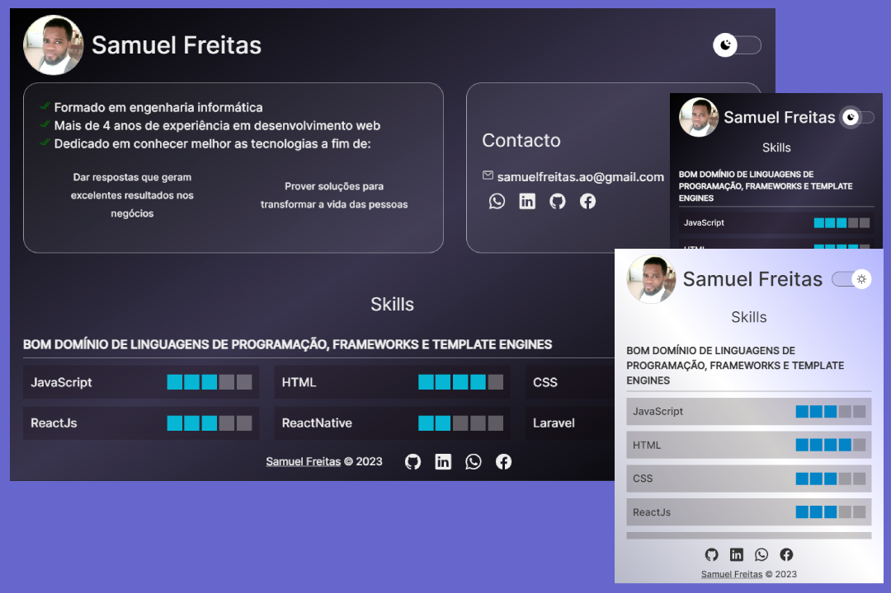

<h1 align="center">Samuel Freitas - Portfólio </h1>

Este portfólio é um agregador de trabalhos/projectos desenvolvidos por mim para usar como cartão de visitas online.

  <a href="#-tecnologias">Tecnologias</a>&nbsp;&nbsp;&nbsp;|&nbsp;&nbsp;&nbsp;
  <a href="#-projecto">Projecto</a>&nbsp;&nbsp;&nbsp;

 

  

## 🚀 Tecnologias

Esse projecto foi desenvolvido inicialmente com as seguintes tecnologias:

- HTML e CSS
- JavaScript
- Git
- Github (hospedagem)

E está num repositório público e só serve de redirecionemento para o projecto final.

O projecto final momento está num repositório privado e desenvolvido com as seguintes tecnologias:

- [Nextjs](https://nextjs.org)
- Vercel (Hospedagem)

Este portfólio pode ser acessado a partir do link abaixo:

- [Acesse o Portfolio](https://samuelfreitas-ao.github.io/portfolio)
